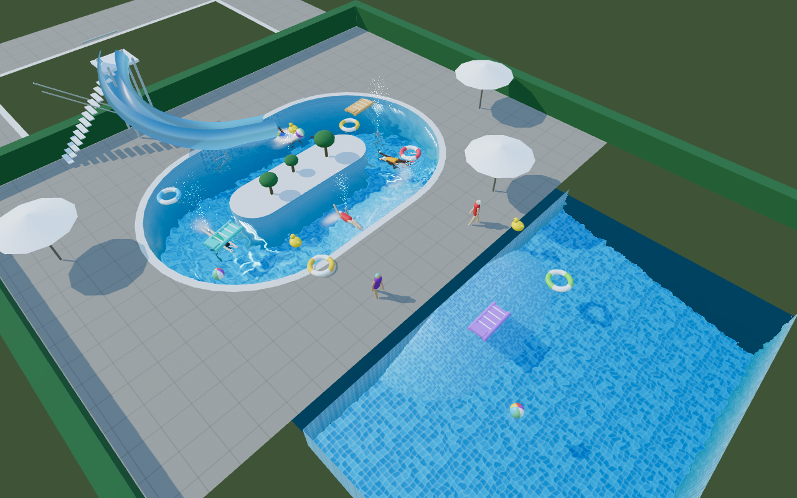

# Pool Simulation

A swimming pool in the browser, built around one idea: everything in the water
interacts with the water, and the water interacts back.

Two pools: a lazy river running a full circuit round an island, with a water
slide dropping riders into it and three fountains throwing water that lands as
real ripples, and an ordinary rectangular pool beside it to just swim in. You
walk between them across the paving, and the rings and mattresses are soft —
they give where you sit on them, and sit lower in the water for it.

Three.js + TypeScript, no binary assets — every model, texture and the sky
itself is generated in code.



## Running it

```sh
npm install
npm run dev        # http://localhost:5173
```

| Command | What it does |
|---|---|
| `npm run dev` | dev server with hot reload |
| `npm run build` | production build into `dist/` |
| `npm run typecheck` | `tsc --noEmit` |
| `npm run test` | unit tests for the simulation and physics (vitest) |
| `npm run smoke` | launches the page in headless Chromium, checks it renders and behaves, writes screenshots to `artifacts/` |

Append `?quality=low`, `?quality=medium` or `?quality=high` to override the
automatic quality guess.

## Controls

| | |
|---|---|
| `W` `A` `S` `D` / arrows | swim, walk or paddle (relative to the camera) |
| `Shift` | sprint |
| `Space` | dive in the water, jump on land, get off a float |
| drag a float | haul it about, and let go to throw it |
| drag | orbit |
| wheel | zoom |
| click the water | splash |

The panel on the right exposes the wave speed and damping, the water's colour
and absorption, foam and caustics, the strength of the river and each jet, the
fountains, the time of day, a button to send someone down the slide, and buttons
to drop more things in.

Swim into the boarding circle at the foot of the slide's steps and you will
climb out and take the slide yourself. Swim into a swim ring or an air mattress
and you climb onto it; `W` then paddles it about, and `Space` gets you off
again. Walk up either pool's entry ramp and you can cross the paving to the
other pool on foot.

## What makes it interact

**One channel for every disturbance.** A float bobbing, a swimmer's hand
entering the water, a droplet landing, a click on the surface — all of them emit
the same `WaveSplat`, and both height fields consume the identical list each
step. Add a new object and it makes correct waves without anyone writing wave
code for it. Every source is built to add no net water, so the pool holds its
level over a long session.

**The loop closes.** Buoyancy emits splats in proportion to how fast a body is
displacing water; those splats become waves; those waves push on every other
body's buoyancy samples. A swimmer's wake rocks a duck three metres away because
that is the only path the forces can take, not because anything says so.

**Nothing is animated along a path.** Swimmers apply thrust in time with their
stroke and steer with torque, so they surge between pulls, get carried by the
current, and are shoved around by a swim ring exactly the way a float is. The
player and the AI swimmers run the same code; the AI just sets a heading and a
throttle.

**The furniture is physics too.** The island, the flume and the fountains are
`WorldFeature`s: they can add forces to a body and resolve contacts with it, and
that is all any of them do. The slide has no rail — riders are ordinary rigid
bodies falling down the inside of a pipe, so they gather speed on the steep
section, ride up the outside of the bend, and go over the side if they carry too
much speed into it, because the pipe is only closed for 300 degrees and there is
nothing above them. The fountains push with the jet's own momentum flux, which
is why the same nozzle throws a beach ball over the deck and does nothing at all
to a swimmer.

**Buoyancy is per-sphere.** A body is a set of spheres, and each one gets its own
surface height, its own submerged cap and its own drag, applied at its own
position. Restoring torque, list under an off-centre load and a swim ring
slapping flat again after you tip it all emerge from that.

**And the spheres are what deforms.** An inflatable is not a rigid body with a
wobbly mesh drawn over it: each proxy sphere carries a radial deflection driven
by the contact impulses actually recorded on it, and the sphere's radius is what
changes. Because those radii are the same numbers buoyancy integrates and the
collision solver tests against, "the ring gives where you sit on it" and "the
ring sits lower on that side" are not two features to keep in step — they are
one number. The buoyancy pass rescales the sphere volumes each step so they
still sum to the body's stated volume, which is a sealed air chamber
redistributing its air: squash one side and the other bulges. The rubber duck
has no shell, because it is hard plastic and should not squash.

**Standing up is contacts too.** A swimmer's spheres run head to toe, so turning
the body upright stacks them into a column that stands on a ramp or a paving
slab through the same contacts that hold a swim ring up. Whether somebody is
swimming or standing is not a state machine — it is two questions about the
world: is the water here shallow enough to stand in, and are their feet near the
bottom. Walk off the edge of the deck and the answer changes on its own.

## The two pools

**The river** is a stadium: a rectangle with its corners filled in to a curve
concentric with the island, so the water is a channel of even width all the way
round. That shape is not decoration. The current is tangential to the island
everywhere and divergence-free, so it transports water without ever piling it
up — but with the corners left open it has to fade out before the walls, and
anything carried through a bend coasts out of the stream and parks in the dead
water for the rest of the session. With both banks in place a float goes round,
and keeps going round. `tests/lazyRiver.test.ts` fails if it does not.

**The calm pool** is a plain rectangle with the arrangement the pool had before
the circuit was cut into it: two wall inlets and a pair of counter-rotating
eddies. That arrangement works here for exactly the reason it stopped working
there — the eddies turn against each other so nothing ever goes all the way
round, and the water just mills about. In a pool you are only swimming in, that
is what you want.

**They are separate pools, in the simulation as well as in the drawing.** One
wave field covers both, with a bathymetry texture carrying the water depth and a
wet flag per cell; a cell whose neighbour is dry reads its own height back
instead, so the wave reflects. That is what keeps the river's chop out of the
calm pool five metres away, and it also fixed something that had been wrong all
along: ripples used to pass straight through the island as though it were not
there. `tests/world.test.ts` strikes one pool and checks the other stays still,
and checks the same field with the land removed does leak — otherwise the test
would pass on a broken build.

**Getting between them** is a ramp in each pool's divide-side wall, and walking.
The ramps started as flights of steps and had to stop being flights of steps:
every wall of the river is also the circuit, so a tread standing in the stream is
a trap, and a beach ball driven onto one parked there and never moved again —
0.92 laps in four minutes against 2.9 with the wall clear. Sloping the faces was
not enough either, because a flank that falls away straight sideways has a
normal pointing back up the stream and the current simply holds things against
it. What works is a surface whose height falls with distance from the crest
*line*: at the ends of the crest the contours are arcs, so the normal turns to
face out into the pool and anything arriving along the wall is deflected past.
With that shape the ramp is invisible to the circuit — 2.90 laps against 2.86
with nothing there at all.

## What makes it look like water

- **Screen-space refraction** with a fallback when the distortion drags an
  object over the surface
- **Beer–Lambert absorption** along the view ray through the water, which is why
  the deep end goes blue-green and the shallow end stays clear
- **Planar reflection** through a mirrored camera with an oblique near plane,
  blended by Fresnel with an analytic sky
- **Caustics by ray convergence** — the floor is lit by the Jacobian of the
  refracted sun rays, so the bands braid and move rather than scrolling
- **Foam** advected by the current, deposited wherever the surface churns
- **Spray** that flies, and then splashes back into the height field on landing
- **A Snell window** when you drop the camera below the surface

## Layout

```
src/
  core/       renderer, camera, sky and lighting, input, constants, shapes,
              and the layout: where the water is and what you can stand on
  sim/        the water: GPU and CPU height fields, flow, foam, shaders
  physics/    rigid bodies, buoyancy, collision, the fixed-step world
  entities/   pools and island, water slide, fountains, swim rings, ducks,
              floats and their riders, swimmers and their AI
  render/     water surface, planar reflection, caustics, spray, textures
  ui/         debug GUI
tests/        unit tests for the pure-logic layer
scripts/      headless render check
```

`src/sim/README.md` covers the water simulation in detail: why there are two
height fields, what keeps the scheme stable, and how splats are applied.

## Verification

The simulation and physics are pure logic with no WebGL dependency, so they are
tested directly: that the height field stays finite when driven far past its
nominal wave speed, that its energy falls monotonically once the driving stops,
that a splat spreads symmetrically and reflects off the walls, that waves refract
towards the shallow end, that a float settles at the draft where displaced water
matches its mass, that a knocked-over duck rights itself, and that collisions
conserve momentum.

Two suites cover the water itself and are deliberately a pair, because either
one alone can be satisfied by breaking the other. `tests/waterLevel.test.ts`
fails if the pool gains or loses volume over a long session.
`tests/waterResponse.test.ts` fails if it stops moving — that someone swimming
visibly stirs the surface, leaves a wake behind them, that a ripple crosses the
pool rather than dying where it started, and that the water settles again once
they stop.

The two pools, the ramps between them, the deformation and the riding get their
own suites. `tests/world.test.ts` covers the layout and the wave mask — that a
wave struck in one pool does not reach the other, that the walkway between them
is dry, that a ramp falls away from its crest in every direction, and that a
swimmer told to head north walks up out of one pool, across the paving and into
the other. `tests/deformation.test.ts` checks the squash is proportional to the
load, spreads to its neighbours and not to the far side, shrinks the proxy
sphere and not only the mesh, springs back, and is tuned slow enough to
integrate honestly at the fixed step. `tests/riding.test.ts` checks that a
swimmer drifting into a ring gets on it and one four metres away does not, that
two people cannot share a ring, that a rider makes the ring float lower *and*
squash, that they squash the side they lean on, that paddling moves it, and —
because the rider is held by a capped spring rather than a constraint — that
hauling the ring out from under them leaves them behind.

The river, the slide and the fountains get the same treatment. `tests/lazyRiver.test.ts` checks
the current is tangential, closed and divergence-free, and then — separately,
because it is a different claim — that a ring, a ball and a mattress dropped in
it each complete a lap of the island. `tests/waterSlide.test.ts` checks the
things a rail would have made true for free: that gravity alone takes a body
down, that nothing comes out faster than the drop allows, that a body longer
than the flume is wide does not wedge across it, and that a rider is never left
stranded halfway. `tests/fountain.test.ts` checks the jet is a plausible one
(bore, flow and column height), that it throws a beach ball clear of the water
while barely moving a swimmer, that it rings the surface with waves purely
through the droplets it throws, and that a minute of it does not raise the pool.

`npm run smoke` covers the parts that need a GPU: it drives the real page in
headless Chromium and asserts the loop is turning, the field is finite and
bounded, swimmers are moving, floats are at plausible waterlines, the floats are
drifting the way the river runs, nothing is stuck inside a wall, both pools have
waves in them while the walkway between them is dry, the player can get onto a
float and squashes it when they do, the fountains have water in the air, the
slide takes a rider, clicking disturbs the water, and no shader failed to
compile.
